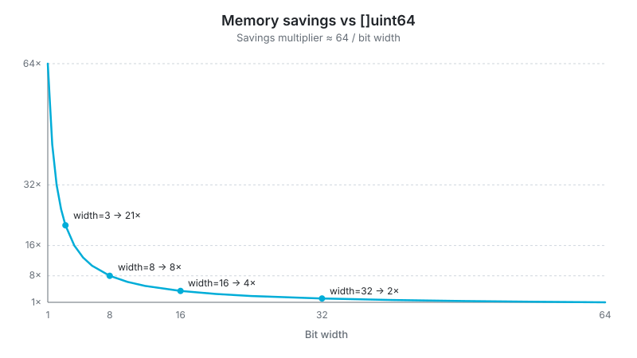

# bitpack ⚛︎

[](https://github.com/owenps/bitpack/actions/workflows/test.yml)
[](https://github.com/owenps/bitpack/releases)
[](https://pkg.go.dev/github.com/owenps/bitpack)
[](https://goreportcard.com/report/github.com/owenps/bitpack)
[](/LICENSE)

A miniature Go library for compact arrays.

## Usage

```go
package main

import (
	"fmt"
	"github.com/owenps/bitpack"
)

func main() {
	a := bitpack.New(1000, 3) // 1000 elements, 3 bits per element.

	for i := range a.Len() {
		a.Set(i, uint64(i%8)) // Set value within [0, 7]
	}

	fmt.Printf("stored %d values in %d bytes\n", a.Len(), a.Size())
	fmt.Printf("[]uint8  would need %d bytes\n", a.Len()*1)
	fmt.Printf("[]uint64 would need %d bytes\n", a.Len()*8)
}
```

```text
stored 1000 values in 376 bytes
[]uint8  would need 1000 bytes
[]uint64 would need 8000 bytes
```

That is **21x smaller than `[]uint64`, and 2.7x smaller than `[]uint8`**.

For more examples see [example_test.go](/example_test.go)



## Benchmarks

All operations run in constant time with zero allocations.
Single-digit nanoseconds per `Set`/`At` call on modern hardware.
Run `go test -bench=. -benchmem` to measure on your own machine.

| Operation  | Width | ns/op  | Allocs |
|------------|-------|-------:|--------|
| `Set`      | 3     |   1.71 | 0      |
| `Set`      | 64    |   1.28 | 0      |
| `At`       | 3     |   1.36 | 0      |
| `At`       | 64    |   1.04 | 0      |
| `Fill`     | 3     |    208 | 0      |
| `Set` loop | 3     | 105743 | 0      |

> Apple M5, Go 1.26. `Fill` / `Set` loop benchmark uses 1M elements.

## Installation

```bash
go get github.com/owenps/bitpack
```

## Road Map

- [ ] Generics support - support other envelopes other than `uint64`. (`uint8`, `uint32`, `uint`)
- [ ] `SetRange()` method - set a range of indices to a given value.
- [ ] `Iter()` method - return an iterator that can hold the current slot in a register and decode multiple values from it before reloading. Can offer significant speed-ups to using for-loop with `At`.

[`v0.2.0`](releases/tag/v0.2.0)
- [x] `FromSlice()` method - automatically calculate the width from a slice. (`v0.2.0`+)
- [x] `ToSlice()` method - mirrors `FromSlice()`.

[`v0.1.1`](releases/tag/v0.2.0)
- [x] `Fill()` method optimizations - Now up to ~500x faster than `Set()` loop.

## License

[MIT](/LICENSE)
